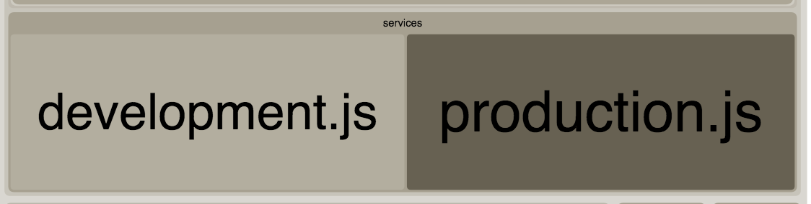
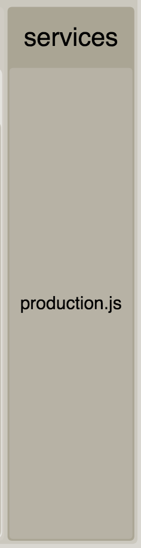

# Exclude modules in SPFx

Sample web part that shows how to exclude certain modules of your production bundle.

## Testing this sample

Try out the code by running the following commands:

```bash
git clone "the repo"
npm i
```

### Development bundle

Run the following command to create a development bundle: 

```bash
gulp bundle
```

Check out the HTML bundle stats file which is located in: `./temp/stats`. In the statistics, you should be able to see the following service includes:



### Production bundle

Run the following command to create a production bundle: 

```bash
gulp bundle --ship
```

Check out the HTML bundle stats file which is located in: `./temp/stats`. In the statistics, you should be able to see the following service includes:




## Solution

The solution works as follows:

```TypeScript
// Include the development service, required for type safety
import * as Dev from "../../../services/development";
```

Where you want to actually use the service, you wrap it in a DEBUG statement block

```TypeScript
// The following block will be removed from production bundles
if (DEBUG) {
  if (Environment.type === EnvironmentType.Local ||
    Environment.type === EnvironmentType.Test) {
      // Load the required development service module
      // Use typeof Dev to maintain type safety
      const Development: typeof Dev = require("../../../services/development");
      Development.default.get().then((data: string[]) => {
        this.setState({
          items: data
        });
      });
    }
  }
}
```
